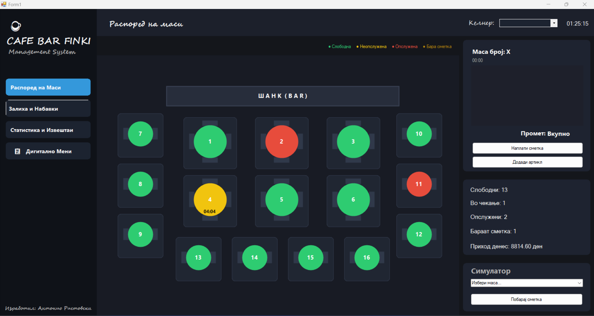
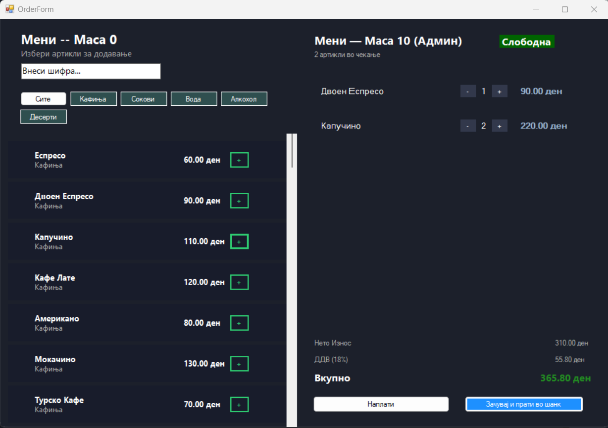
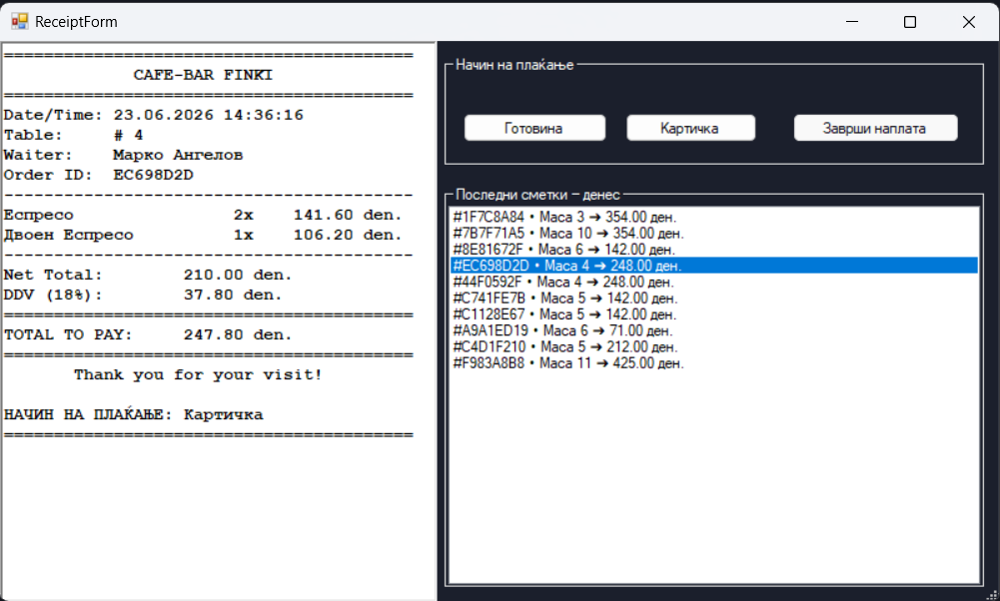
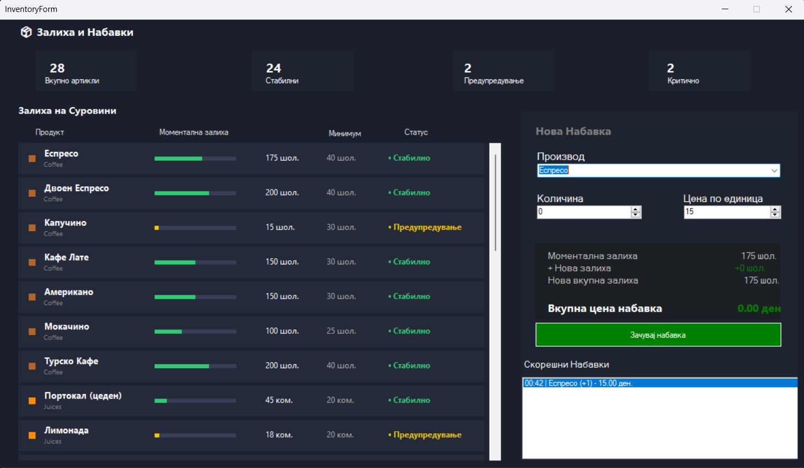
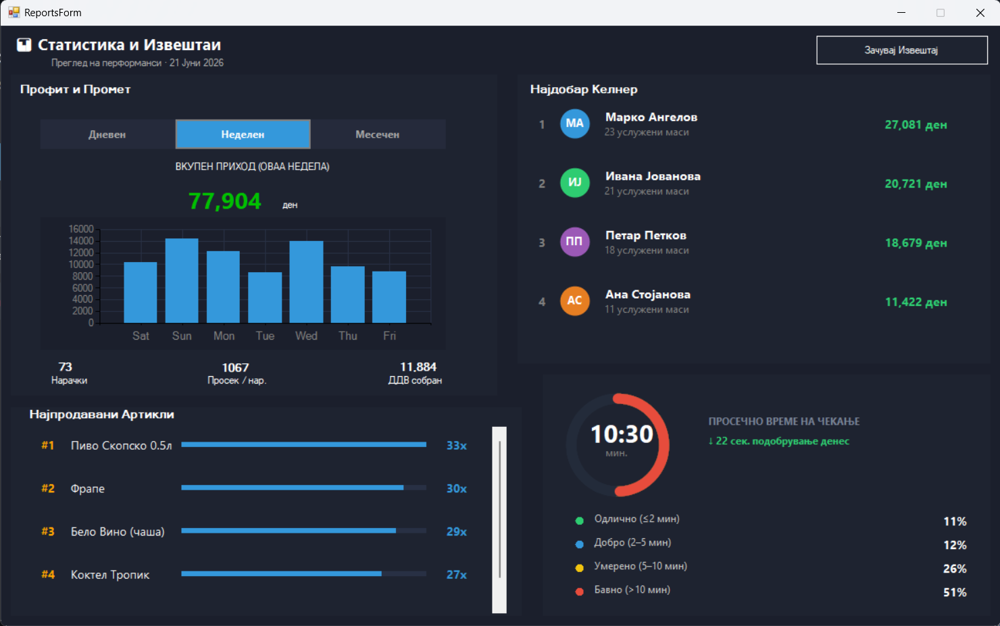

# ☕ Кафе-Бар Менаџер со паметна статистика и следење на ефикасност

> Десктоп апликација за комплетно менаџирање на кафе-бар/ресторан — маси, нарачки, залихи и финансиска аналитика — изработена во **C# Windows Forms (.NET Framework 4.7.2)** со целосно custom **GDI+** рендерирање на распоредот на маси.

**Предмет:** Визуелно Програмирање — ФИНКИ, УКИМ
**Технологии:** C# · Windows Forms · GDI+ · OOP
**Тип на проект:** Индивидуален проект

---

## 📋 Содржина

1. [Објаснување на проблемот](#1--објаснување-на-проблемот)
2. [Опис на решението](#2--опис-на-решението)
3. [Карактеристичен алгоритам](#3--карактеристичен-алгоритам)
4. [Снимки од екран](#4--снимки-од-екран)
5. [Упатство за инсталација и користење](#5--упатство-за-инсталација-и-користење)
6. [Познати ограничувања и идеи за надоградба](#6--познати-ограничувања-и-идеи-за-надоградба)
7. [Користење на Генеративна Вештачка Интелигенција](#7--користење-на-генеративна-вештачка-интелигенција)

---

## 1. 📖 Објаснување на проблемот

### 1.1 Деловен контекст

Модерниот кафе-бар бара брза, прецизна координација помеѓу келнерите и менаџментот. Без дигитален систем се јавуваат типични проблеми:

- **Нема видливост во реално време** кои маси се слободни, кои чекаат нарачка (жолто), а кои се веќе опслужени (црвено).
- **Нема мерење на ефикасност** — не се знае колку чекаат гостите по рунда, ниту се чува историја на тоа време за подоцнежна анализа.
- **Рачно водење на залихи** е подложно на грешки и не дава навремено предупредување кога некој продукт е критично малку на залиха.
- **Нема финансиска аналитика** по ден за да менаџерот донесе деловни одлуки (кој продукт се продава најмногу, колкав е дневниот промет).

### 1.2 Цел на апликацијата

„Кафе-Бар Менаџер" е point-of-sale десктоп систем кој ги решава овие проблеми преку:

| Модул | Што решава |
|---|---|
| 🗺️ Графички распоред на маси (`BarLayout`) | Custom-нацртана мапа со 17 маси и шанк, кликабилна, со живи тајмери |
| 🧾 Менаџмент на нарачки (`OrderForm`, `Order`, `OrderItem`) | Мени по категории, кошничка по маса, автоматска пресметка на ДДВ |
| 🔔 Симулатор за барање сметка | Визуелно трепкање на маса кога гостите бараат сметка (без посебен Timer по маса) |
| 🧾 Фискални сметки (`ReceiptForm`) | Генерирање, преглед и архивирање на сметки како `.txt` фајлови |
| 📦 Залихи (`InventoryForm`) | Преглед на тековна залиха по продукт + логирање на секоја набавка со трајно зачувување во JSON фајлови (products.json и purchase_logs.json) |
| 📊 Извештаи (`ReportsForm`) | Дневен/неделен/месечен промет, графикон на приход, топ-продавани артикли, топ-келнери |

### 1.3 Целна група

Сопственици и менаџери на мали и средни кафе-барови кои сакаат лесен, целосно локален (offline, без cloud/база на податоци) систем за дневна работа.

---

## 2. 🏗️ Опис на решението

### 2.1 Архитектура (High-Level)

```
┌──────────────────────────────────────────────────────────────┐
│                     PRESENTATION LAYER                       │
│  Form1.cs  ·  OrderForm.cs  ·  InventoryForm.cs              │
│  ReportsForm.cs  ·  ReceiptForm.cs                           │
│  Controls: MenuProductControl.cs  ·  OrderItemControl.cs     │
└──────────────────────────┬───────────────────────────────────┘
                           │ повикување методи на моделот
┌──────────────────────────▼───────────────────────────────────┐
│                     DOMAIN / MODEL LAYER                     │
│  Table.cs (+ TableStatus enum)  ·  BarLayout.cs              │
│  Order.cs  ·  OrderItem.cs                                   │
│  Product.cs (+ ProductCategory enum)  ·  InventoryLog.cs     │
└──────────────────────────┬───────────────────────────────────┘
                           │ читање/запис
┌──────────────────────────▼──────────────────────────────────────┐
│                     DATA LAYER                                  │
│  List<Table> / List<Product> / List<Order> — целосно во меморија│
│  Фискални сметки → локални .txt фајлови (File API)              │
│  Залиха и Набавки → Локална JSON перзистенција (.json фајлови)  │
└─────────────────────────────────────────────────────────────────┘
```

>Состојбата на масите и дневниот промет се чуваат во меморија за времетраењето на сесијата. Меѓутоа, за менаџментот со залиха и историјатот на набавки (InventoryForm) имплементирана е трајна перзистенција со зачувување и вчитување преку JSON фајлови (products.json и purchase_logs.json), што овозможува континуитет во работењето на шанкот и при рестарт на апликацијата. Фискалните сметки се трајно зачувани како .txt фајлови.

### 2.2 Клучни класи и enum-и

| Класа / Enum | Намена |
|---|---|
| `TableStatus` (enum) | `Free` (зелена), `OccupiedUnserved` (жолта), `OccupiedServed` (црвена) |
| `Table` | Координати (X, Y, Width, Height), состојба, тајмери (`SeatingTime`, `OrderServedTime`), `IsRequestingBill`, `RoundWaitTimes` за историја на ефикасност по рунда |
| `BarLayout` | Чува `List<Table>` со фиксен распоред (17 маси + шанк) и го рендерира целиот под со GDI+ во `Draw(Graphics g)` |
| `ProductCategory` (enum) | `Coffee`, `Juices`, `Water`, `Alcohol`, `Desserts` |
| `Product` | Артикл од менито — `ID`, `Name`, `Price`, `PurchasePrice`, `Stock`, `MinStock`, бројачи на продажба, computed `StockStatus` |
| `Order` / `OrderItem` | Нарачка по маса со ставки, автоматски пресметани `TotalNet` / `TotalDDV` / `TotalWithDDV`, генерира текст на фискална сметка |
| `InventoryLog` | Запис за секоја направена набавка (продукт, количина, цена, датум) |

### 2.3 Релации помеѓу класите

```
Form1 (главен прозорец, GDI+ canvas)
  ├── BarLayout
  │      └── List<Table>   (17 маси, секоја со фиксни X/Y/Width/Height)
  │             └── Order  (тековна, 1:1 — null додека е слободна)
  │                    └── List<OrderItem>
  │                           └── Product  ←──┐
  └── List<Product> (заедничко мени)  ────────┘ (единствена инстанца, делена со OrderForm/InventoryForm)

OrderForm(table, waiter, sharedMenu)   ← отвора Form1 при клик на маса; ја прима ИСТАТА листа продукти
ReceiptForm(table)                      ← генерира/чита .txt сметки
InventoryForm(sharedMenu)               ← преглед залихи + List<InventoryLog>
ReportsForm(dailyPaidOrders)            ← Chart + Top Products/Waiters од платени нарачки
```

> 💡 И `OrderForm` и `InventoryForm` примаат **референца кон истата `List<Product>`** инстанца од `Form1` — суштинска одлука која гарантира дека намалувањето на залихата при продажба (`Product.RegisterSale()`) е видливо на сите места во апликацијата истовремено.

### 2.4 GDI+ Рендерирање на подот

Целиот распоред на маси е custom-нацртан, без стандардни Button контроли:

- `BarLayout.InitializeLayout()` рачно поставува 17 маси со конкретни X/Y координати во 3 групи: централни големи маси, странични мали маси и долен хоризонтален ред.
- `BarLayout.Draw(Graphics g)` го исцртува шанкот, заоблена картичка позади секоја маса (`GraphicsPath` + `AddArc`), столчиња и самата маса како елипса во боја според `Table.GetStatusColor()`.
- `Table.IsClicked(mouseX, mouseY)` прави правоаголен hit-test за да се детектира кликната маса.
- Под секоја маса се исписува живо ажурирано време на чекање преку `Table.GetCurrentWaitTime()`.

### 2.5 Технологии и компоненти

| Компонента | Употреба |
|---|---|
| `System.Drawing` (GDI+) | Цртање на цел под, маси, столчиња, статусни бои, текст |
| `System.Windows.Forms.Timer` | Ажурирање на UI и тајмерите на масите на секоја секунда |
| `System.Windows.Forms.DataVisualization.Charting` | `Chart` контрола за приказ на приход во `ReportsForm` |
| `RichTextBox` | Преглед на фискална сметка во `ReceiptForm` |
| `File` / `Directory` | Зачувување и читање на сметки како `.txt` фајлови |

---

## 3. ⚙️ Карактеристичен алгоритам

### 3.1 Проблем: Трепкање на маса без посебен `Timer` по маса

Кога гостите "бараат сметка" (`Table.IsRequestingBill = true`), соодветната маса треба визуелно да трепка за да привлече внимание на келнерите. Посебен `Timer` за секоја од 16 маси би бил непотребно скап во меморија и CPU при чести `Tick` настани.

### 3.2 Решение: Time-based блинк во самиот `Paint` настан

Наместо посебен тајмер по маса, се користи веќе постоечкиот системски тајмер (1 сек) во комбинација со математичка формула базирана на тековното системско време. Привремениот "блинк" статус се поставува, се исцртува, и веднаш се враќа во оригиналната вредност — во рамки на еден единствен `Paint` повик:

```csharp
private void pnlTablesFloor_Paint_1(object sender, PaintEventArgs e)
{
    e.Graphics.SmoothingMode = System.Drawing.Drawing2D.SmoothingMode.AntiAlias;

    bool slowBlink = (DateTime.Now.Second / 2) % 2 == 0;

    Dictionary<int, TableStatus> originalStatuses = new Dictionary<int, TableStatus>();

    foreach (Table table in barLayout.Tables)
    {
        if (table.IsRequestingBill)
        {
            originalStatuses[table.TableNumber] = table.Status;
            table.Status = slowBlink ? (TableStatus)99 : TableStatus.OccupiedServed;
        }
    }

    barLayout.Draw(e.Graphics);

    foreach (Table table in barLayout.Tables)
    {
        if (table.IsRequestingBill && originalStatuses.ContainsKey(table.TableNumber))
            table.Status = originalStatuses[table.TableNumber];
    }
}
```

**Зошто работи без дополнителна меморија:**

1. Веќе постоечкиот системски `Timer` ја повикува `pnlTablesFloor.Invalidate()`, што форсира повторно извршување на `Paint`.
2. `DateTime.Now.Second` природно осцилира 0→59; деленото со 2 и `% 2` создава детерминистички on/off сигнал на секои 2 секунди, без посебна "tick count" променлива.
3. `(TableStatus)99` е explicit cast надвор од дефинираните вредности на enum-от — користен исклучиво како привремен render-сигнал. Бидејќи се чува во `originalStatuses` и веднаш се враќа, моделот никогаш не "остава" во невалидна состојба надвор од овој метод.

| Аспект | Timer по секоја маса (17×) | Time-formula пристап (овој проект) |
|---|---|---|
| Број на тајмери | До 17 | 1 |
| CPU оптовареност | Расте линеарно со број маси | Константна |
| Ризик од state leak | Висок ако се заборави `Stop()` | Нула — save/restore во истиот метод |

### 3.3 Пресметка на ефикасност по рунда

```csharp
public void OrderServed()
{
    if (this.Status != TableStatus.OccupiedUnserved)
        throw new InvalidOperationException("Масата мора прво да има нарачка за да биде услужена.");

    this.Status = TableStatus.OccupiedServed;
    this.OrderServedTime = DateTime.Now;

    TimeSpan durationOfThisRound = this.OrderServedTime.Value - this.SeatingTime.Value;
    this.RoundWaitTimes.Add(durationOfThisRound);
}
```

Секоја маса чува `List<TimeSpan> RoundWaitTimes` — за секоја "рунда" (од седнување до опслужување) се додава нов запис, а `GetAverageWaitTime()` пресметува просек низ сите рунди за таа маса, без потреба од надворешна база на податоци.

### 3.4 Безбедно ажурирање на залихата при делумна промена на нарачка

Кога келнерот менува количини во `OrderForm` (преку привремена `temporaryItems` листа додека прозорецот е отворен), финалното потврдување пресметува **делта** наместо слепо да ја регистрира целата количина повторно:

```csharp
int deltaQuantity = tempItem.Quantity - realItem.Quantity;
if (deltaQuantity > 0)
    tempItem.SelectedProduct.RegisterSale(deltaQuantity);
```

Ова спречува двојно одземање од залихата ако истиот артикл веќе бил зачуван во претходна сесија на истата маса.

---

## 4. 📸 Снимки од екран

### 4.1 Главен екран — Распоред на маси

 
*Графички приказ на 17 маси и шанк со GDI+ цртање; боја според состојба (зелена/жолта/црвена).*

### 4.2 Форма за нарачка


*Избор на артикли по категорија, пребарување по шифра, и кошничка со автоматска пресметка на ДДВ.*

### 4.3 Фискална сметка


*Преглед на сметка, избор на начин на плаќање, и листа на скорешни сметки.*

### 4.4 Залихи и набавки


*Преглед на залиха по продукт со статусен индикатор (Стабилно / Предупредување / Критично ниско) и форма за нова набавка.*

### 4.5 Статистика и извештаи


*Графикон на приход по период (дневно/неделно/месечно), топ-5 продавани артикли, и рангирани келнери.*


---

## 5. 🚀 Упатство за инсталација и користење

### 5.1 Системски барања

- Windows 10/11
- **.NET Framework 4.7.2** (Developer Pack, за компилирање од извор)
- Visual Studio 2022 (или новија верзија со поддршка за .NET Framework WinForms проекти)

### 5.2 Инсталација

```bash
git clone https://github.com/ristovvskii/CafeBarManager.git
cd CafeBarManager
```

Отвори `CafeBarManager.slnx` во Visual Studio → **Build → Rebuild Solution** → **Start (F5)**.

### 5.3 Чекор-по-чекор користење

| Чекор | Акција | Резултат |
|---|---|---|
| 1 | Стартувај апликација | Се прикажува графичкиот под со 17 маси и шанкот; неколку маси веќе се демонстративно зафатени |
| 2 | Избери активен келнер од `cmbWaiter` | Сите следни нарачки за избраната маса се поврзани со тој келнер |
| 3 | Кликни на слободна (зелена) маса | Се отвора `OrderForm` за избраната маса |
| 4 | Додади артикли од менито (по категории или преку шифра) | Се градат привремени ставки во кошничка со live пресметка на ДДВ |
| 5 | Кликни главното копче ("Зачувај и прати во шанк") | Се потврдува нарачката, масата станува жолта, почнува тајмерот |
| 6 | Кликни "Испорачано" | Масата станува црвена, времето за тековната рунда се запишува во `RoundWaitTimes` |
| 7 | (Опционо) Активирај симулатор за барање сметка | Масата визуелно трепка на секои 2 секунди |
| 8 | Кликни "Наплати" → `ReceiptForm` | Се генерира фискална сметка, се зачувува како `.txt`, масата се ослободува |
| 9 | Отвори "Залиха и Набавки" | Прегледај тековна залиха по продукт; додади нова набавка |
| 10 | Отвори "Статистика и Извештаи" | Прегледај промет по период, топ-производи и топ-келнери |

### 5.4 Структура на проекта

```
CafeBarManager/
├── CafeBarManager.slnx
└── CafeBarManager/
    ├── Form1.cs / Form1.Designer.cs       → главен прозорец, GDI+ под со маси
    ├── BarLayout.cs                        → распоред и цртање на 16 маси + шанк
    ├── Table.cs                            → модел на маса + TableStatus enum
    ├── OrderForm.cs / .Designer.cs         → мени и нарачка по маса
    ├── Order.cs / OrderItem.cs             → модел на нарачка и ставки
    ├── Product.cs                          → модел на артикл + ProductCategory enum
    ├── MenuProductControl.cs / .Designer.cs→ UI картичка за артикл во менито
    ├── OrderItemControl.cs / .Designer.cs  → UI ред за ставка во кошничка
    ├── ReceiptForm.cs / .Designer.cs       → преглед, печатење, .txt извоз/читање сметки
    ├── InventoryForm.cs / .Designer.cs     → преглед на залиха
    ├── InventoryLog.cs                     → запис за набавка/промена на залиха
    ├── ReportsForm.cs / .Designer.cs       → Chart + топ-продавани артикли/келнери
    ├── Program.cs                          → влезна точка (Main)
    └── Properties/                         → AssemblyInfo, ресурси
```

---

## 6. 🔧 Познати ограничувања и идеи за надоградба

Овој проект е изработен индивидуално во рамки на семестрален курс, со јасна свест дека одредени делови можат да се надоградат во иднина:

- **Нема "Undo" за грешно затворена маса** — штом `ClearTable()` се изврши, нема механизам за враќање на нарачката доколку келнерот погрешно наплати.
- **`GenerateMockOrders()` користи случаен генератор за демо-податоци** — одлично за презентација и тестирање на извештаите, но во продукциска верзија треба да се отстрани или да се сврзе со флаг за demo-режим.
- **Нема поддршка за повеќе истовремени корисници/уреди** — апликацијата е дизајнирана за еден компјутер/каса, не за мрежна синхронизација помеѓу повеќе терминали.
- **UI распоредот на 16 маси е хардкодиран** во `BarLayout.InitializeLayout()` — динамичко уредување на распоредот (drag & drop за менаџерот да го прилагоди подот кон сопствениот локал) би било природна следна функција.
- **Нема ниво на пристап/логин за вработени** — секој може да избере произволно име на келнер од паѓачкото мени, без лозинка или сметка.


---

## 7. 🤖 Користење на Генеративна Вештачка Интелигенција

Во согласност со академскиот интегритет на ФИНКИ, оваа секција транспарентно ги наведува сите користени AI алатки при изработка на проектот.

### 7.1 Anthropic Claude (claude.ai) — 2026

**Улога:** Архитектонски совети за OOP дизајн, рефактор на event-driven комуникација помеѓу `Form1` и `OrderForm`, идентификување и поправка на конкретни bug-ови во постоечкиот код, и структурирање на оваа документација.

Конкретни области каде беше консултиран:
- Event-based нотификација (`TableChanged` event) за синхронизација помеѓу `Form1` и попап-форми без модални блокирања
- Стратегија за безбедно откажување на нарачка (snapshot/backup на `Order` пред отворање на `OrderForm`, restore при затворање со „X")
- **Откривање и поправка на конкретен bug**: `OrderForm` првично креираше своја сопствена `Product.CreateMenu()` листа наместо да ја дели листата од `Form1`, што значеше дека намалувањето на залиха при продажба не се одразувало во `InventoryForm`. Поправено со пренос на заедничка `List<Product>` референца преку конструктор.
- **Поправка на логика за регистрирање продажба**: првичната `CommitTemporaryChanges()` директно манипулираше со `Items.Add()` заобиколувајќи `RegisterSale()`; поправено со delta-базирана пресметка која точно ги одразува промените во количина без двојно одземање од залихата.
- Целосен преглед на изворниот код на репозиториумот за прецизно усогласување на оваа документација со реалната имплементација

### 7.2 Критичка проверка

Сите AI-генерирани предлози и идентификувани проблеми беа рачно прегледани, тестирани во Visual Studio, и применети по сопствена одлука пред интеграција. Концептот, идејата, целата UI/UX визија, распоредот на 17 маси, и сите архитектонски одлуки се целосно самостојна и моја индивидуална работа.

---


## 🌿 Развоен процес

Проектот е развиван преку feature-branch workflow:
- `feature-simulator` — [PR #1](https://github.com/ristovvskii/CafeBarManager/pull/1) ✅ Merged
- `fix/shared-menu-and-inventory` — [PR #2](https://github.com/ristovvskii/CafeBarManager/pull/2) ✅ Merged
- `feature/json-data` — [PR #3](https://github.com/ristovvskii/CafeBarManager/pull/3) ✅ Merged

---

## 📄 Лиценца

Овој проект е изработен за академски цели како дел од предметот **Визуелно Програмирање** на ФИНКИ, УКИМ.

## 👤 Автор

Антонио Ристовски — 241029 — Академска 2025/2026
